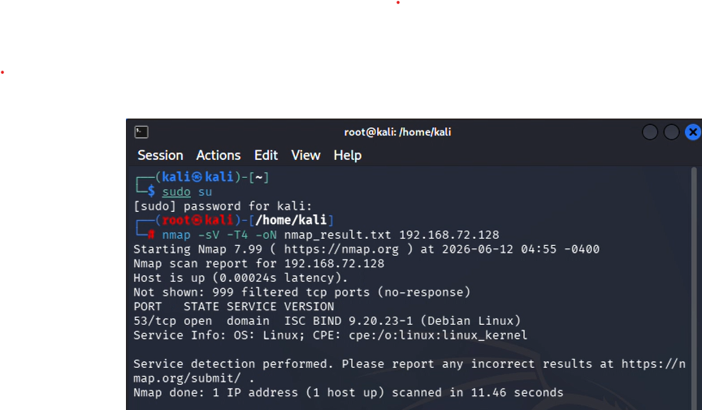

# Nmap Service Detection Scan Report

## Project Objective

The objective of this task was to perform a service detection scan using Nmap to identify open ports, running services, and version information on a target host within a virtualized network environment. This activity demonstrates basic network reconnaissance and service enumeration techniques commonly used during security assessments.

---

## Environment

- **Operating System:** Kali Linux
- **Virtualization Platform:** VMware Workstation
- **Target IP Address:** `192.168.72.128`
- **Scanning Tool:** Nmap v7.99

---

## Methodology

The scan was executed using the following command:

```bash
nmap -sV -T4 -oN nmap_result.txt 192.168.72.128
```

### Command Parameters

* **-sV** : Enables service and version detection on discovered open ports.
* **-T4** : Uses an aggressive timing template to speed up the scan.
* **-oN** : Saves the scan results in normal format to a file named `nmap_result.txt`.

---

## Scan Results

| Port | Protocol | State | Service      | Version                           |
| ---- | -------- | ----- | ------------ | --------------------------------- |
| 53   | TCP      | Open  | Domain (DNS) | ISC BIND 9.20.23-1 (Debian Linux) |

### Additional Information

* **Host Status:** Up
* **Latency:** 0.00024 seconds
* **Operating System:** Linux
* **CPE:** `cpe:/o:linux:linux_kernel`

---

## Security Analysis

### Port 53 (DNS Service)

Port 53 is commonly used by the Domain Name System (DNS) for resolving domain names into IP addresses. The scan identified an active DNS service running on the target host.

The detected service is:

* **ISC BIND 9.20.23-1**
* Running on a Linux-based system

DNS servers play a critical role in network communication and are often targeted during security assessments because they can be exploited if improperly configured.

### Potential Security Risks

* **DNS Spoofing:** Attackers may provide forged DNS responses to redirect users to malicious websites.
* **Cache Poisoning:** Malicious DNS records may be inserted into the DNS cache, causing incorrect name resolution.
* **Zone Transfer Misconfiguration:** Unauthorized users may obtain DNS zone information if transfers are not restricted.
* **Denial-of-Service (DoS) Attacks:** DNS services can be abused to disrupt network availability.

---

## Recommended Security Measures

1. Restrict DNS access to trusted hosts and networks.
2. Disable unnecessary DNS features and services.
3. Configure proper access controls for zone transfers.
4. Enable DNSSEC to protect against DNS spoofing and cache poisoning.
5. Regularly update and patch the DNS server software.
6. Monitor DNS logs for unusual or suspicious activity.

---

## Conclusion

The Nmap service detection scan identified a single open port, **53/TCP**, running the **ISC BIND DNS service** on a Linux host. The service appears to be functioning normally and is likely providing DNS resolution within the virtualized network environment. While DNS services are essential for network operations, they should be properly secured and monitored to prevent abuse and potential attacks.

---

## Screenshot


